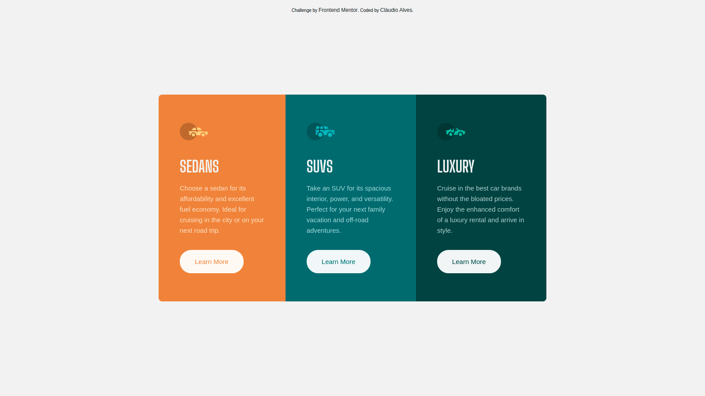

# 3-column preview card component

This is a solution to the <strong> <a href="https://www.frontendmentor.io/challenges/3column-preview-card-component-pH92eAR2-"> 3-column preview card component</a> </strong>

Frontend Mentor challenges help you improve your coding skills by building realistic projects.

### Overview
This challenge is perfect for those just starting out. Switching between layouts is a good test for anyone new to building responsive designs.

### The challenge

The challenge is to build a 3-column preview card component and make it as close to the design as possible.

### Screenshot



### Links

 - Solution URL: https://www.frontendmentor.io/solutions/card-components-using-mobile-first-workflow-html5-css3-and-flexbox-F8uG-Ldzv
 - Live Site URL:https://claudioalvesmachado.github.io/preview-card/
 
 
### Build with:

 -  HTML5 
 - CSS3
 - Flexbox
 - Mobile first workflow
 
 
### What I learned
  
I learned this CSS property and it made my code a lot easier 
 
```css
  button {
    mix-blend-mode: screen;
}
```

## Author 

 - Frontend Mentor - <strong> <a href="https://www.frontendmentor.io/profile/claudioalvesmachado">Cláudio Alves</a> </strong>
 
